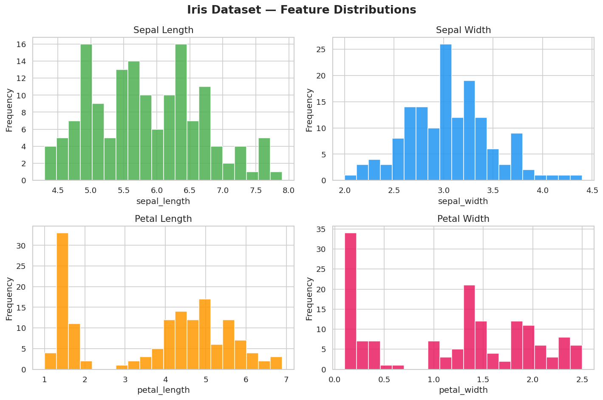
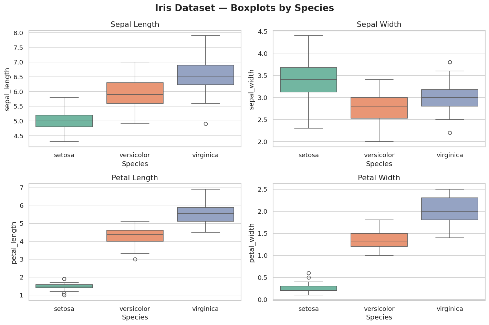
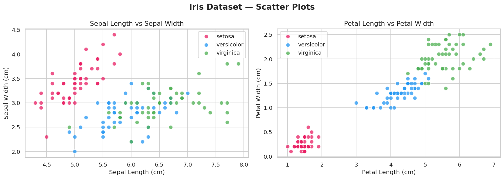
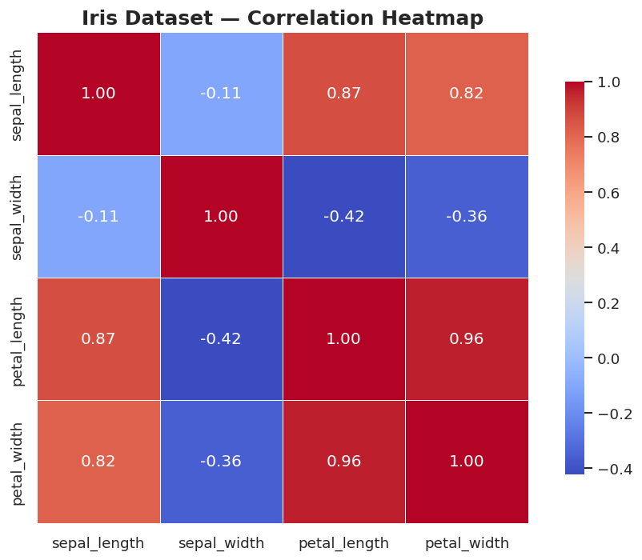
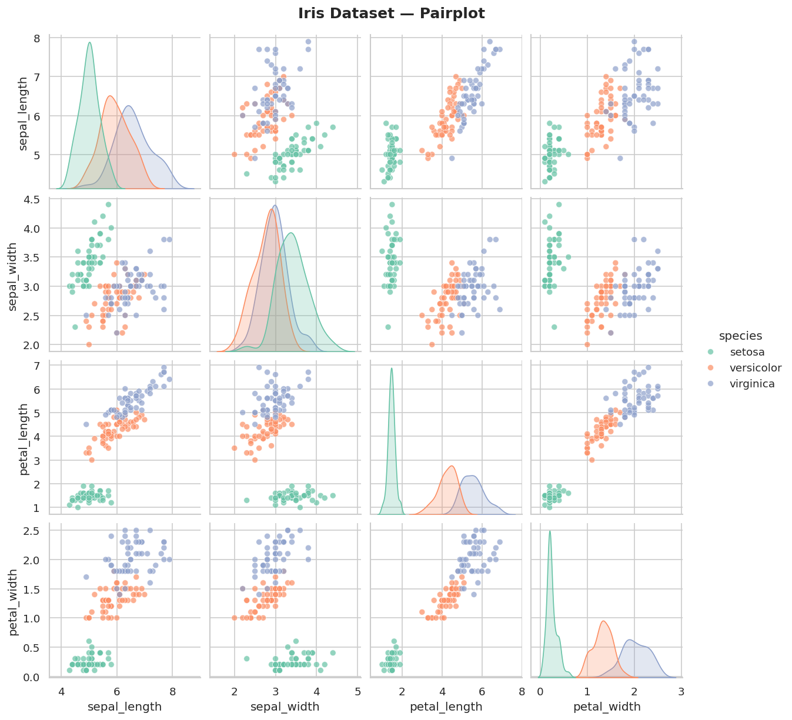

# 🌐 Codveda Technologies — Data Analytics Internship


---

## 👤 Intern Details

| Field        | Details                  |
|--------------|--------------------------|
| **Name**     | Mohinuddin Suriya        |
| **Role**     | Data Analysis Intern     |
| **Company**  | Codveda Technologies     |
| **ID**       | CV/A1/69314              |
| **Duration** | 1 Month                  |

---

## 📁 Repository Structure

```
Codveda-Internship/
│
├── Level_1/                  ← Basic Tasks (Completed ✅)
│   ├── task1_data_cleaning.py
│   ├── task2_eda.py
│   ├── house_cleaned.csv
│   ├── eda_histograms.png
│   ├── eda_boxplots.png
│   ├── eda_scatter.png
│   ├── eda_correlation.png
│   ├── eda_pairplot.png
│   └── README.md
│
├── Level_2/                  ← Intermediate Tasks (Coming Soon 🔄)
│
└── Level_3/                  ← Advanced Tasks (Coming Soon 🔄)
```

---

## ✅ Level 1 — Basic Tasks

### 📌 Task 1: Data Cleaning and Preprocessing
**Dataset:** House Prediction Data Set (Boston Housing)

**Objective:** Clean and preprocess a raw dataset containing missing values, duplicates, and inconsistent formats.

**What was done:**
- Loaded dataset using `pandas` with proper column names
- Identified and handled **40 missing values** using **median imputation**
- Detected and removed **5 duplicate rows**
- Standardized data formats:
  - `CHAS` converted to **categorical** (binary 0/1)
  - `RAD` converted to **integer**
  - Float columns **rounded to 4 decimal places**
- Detected outliers using the **IQR method**
- Saved cleaned dataset as `house_cleaned.csv`

**Tools Used:** Python, pandas, numpy

---

### 📌 Task 2: Exploratory Data Analysis (EDA)
**Dataset:** Iris Dataset

**Objective:** Perform exploratory analysis to identify patterns, trends, and summary statistics.

**What was done:**
- Calculated summary statistics — Mean, Median, Mode, Standard Deviation
- Visualized feature distributions using **Histograms**
- Analyzed spread and outliers using **Boxplots** (by species)
- Explored relationships using **Scatter Plots**
- Found correlations between features using a **Heatmap**
- Generated a **Pairplot** for all feature combinations

**Key Finding:** Petal length and petal width are highly correlated (r = 0.96), making them strong predictors for species classification.

**Tools Used:** Python, pandas, matplotlib, seaborn

---

## 📊 Output Visualizations

### Histograms — Feature Distributions


### Boxplots — Distribution by Species


### Scatter Plots — Feature Relationships


### Correlation Heatmap


### Pairplot


---

## 🛠️ Libraries & Tools

| Library      | Purpose                        |
|--------------|-------------------------------|
| `pandas`     | Data loading and manipulation |
| `numpy`      | Numerical operations          |
| `matplotlib` | Data visualization            |
| `seaborn`    | Statistical visualizations    |

---

## ▶️ How to Run

1. Clone this repository:
```bash
git clone https://github.com/YOUR_USERNAME/Codveda-Internship.git
```

2. Install required libraries:
```bash
pip install pandas numpy matplotlib seaborn
```

3. Run Task 1:
```bash
python task1_data_cleaning.py
```

4. Run Task 2:
```bash
python task2_eda.py
```

---

## 🔗 Connect With Me

[](www.linkedin.com/in/mohinuddin-suriya-391b62307)
[](https://github.com/mohinuddinsuriya-blip)

---

> 🏢 **Codveda Technologies** — Empowering Growth with IT Innovation
> 🌐 [www.codveda.com](https://www.codveda.com)
